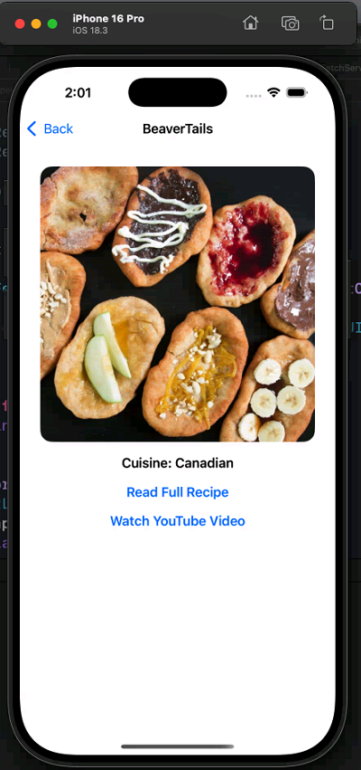

# Fetch-A-Recipe

## Summary

**Fetch-A-Recipe** is a SwiftUI iOS application that fetches recipe data from an API and displays a list of recipes to the user. It showcases modern iOS development techniques like Swift Concurrency (async/await) and improves the app performance with caching and clean architecture. 
Users can load a list of recipes, view recipe details for each recipe, and refresh the content on demand.

**Key Features:**

- **Recipe List:** Displays a list of recipes with each recipe’s **name**, **cuisine type**, and a thumbnail **photo**. This list is the first view that is displayed when the app is launched.
- **Manual Refresh:** Allows the user to manually refresh the recipe list.
- **Recipe Details:** Tapping on a recipe shows a detail view with more information like an **image of the recipe**, a **link to the recipe**, and a **youtube link**.
- **Image Caching:** Custom image caching system (in-memory and on-disk) ensures images load quickly and are reused without repeated network calls.
- **Error Handling:** Handles errors such as network issues or empty/malformed API responses by showing error messages.
- **Swift Concurrency:** Built using Swift’s async/await for all asynchronous operations.

---

## Screenshots

### Home Screen - List View of Recipes


### Recipe Screen - Detail View of a selected recipe

---

## ALL FEATURES:
**UI Features (SwiftUI Frontend)**
- **Recipe List View:** Displays a scrollable list of recipes showing the recipe's name, cuisine type, and a small image.
- **Pull-to-Refresh:** Allows users to refresh the list manually by pulling down the list or tapping a toolbar button.
- **Recipe Detail View:** Displays more detailed information about the selected recipe.
- **Error States:** Displays user-friendly error messages if data fails to load (e.g., network error, malformed data, empty data).
- **Navigation:** Smooth navigation from the list view to the recipe detail view using SwiftUI `NavigationLink`.
- **Adaptive Layout:** Works correctly across different iPhone screen sizes using SwiftUI’s responsive layouts.

**Backend Features (ViewModel & Caching Logic)**
- **Recipe Fetching (Networking):** Fetches recipe data from a JSON API endpoint asynchronously using `Swift Concurrency (async/await)`.
- **State Management:** Uses SwiftUI's `@StateObject` and `@Published` properties to manage UI states.
- **Memory Image Caching:** Caches downloaded images in memory using `NSCache`, to avoid redundant network calls.
- **Disk Image Caching:** Saves downloaded images to local disk storage `FileManager`.
- **Load from Cache First:** Tries to load images from memory cache, then disk cache, then network.
- **Main Thread work:**: Uses `@MainActor` to ensure all UI state updates happen on the main thread.

**API Integration (Recipe API)**
- **Recipes Endpoint:** uses the main recipes API (https://d3jbb8n5wk0qxi.cloudfront.net/recipes.json) to fetch proper recipe data.
- **Malformed Data Handling:** Detects if the API returns malformed JSON and handles it by showing an error.
- **Empty Data Handling:** Detects if the API returns an empty recipe list and shows a friendly empty state to the user.
- **HTTP Response Validation:** Validate that API responses have a proper HTTP 200 OK status before trying to decode the JSON.
- **JSON Decoding:** Decodes JSON responses into Swift models.

**Testing Features (Unit Tests & UI Tests)**
- **Fetching Recipes Unit Tests:** Tests API success, empty responses, and malformed responses.
- **Image Loading Unit Tests:** Tests image loading from memory cache and error handling when URL is invalid.
- **ViewModel Unit Tests:** Tests ViewModel behavior on successful fetch, empty data, and correct errors.
- **Basic UI Tests (XCUI Tests):** Simulates user flows like app launch, recipe list loading, tapping on a recipe, navigating to the details view and tests for expected app behaviors.

---


## Focus Areas

- **Swift Concurrency (async/await):** All network calls, data fetching and loading use Swift's concurrency features. Using **async/await** throughout the codebase makes asynchronous code easier to maintain. This included data fetching, decoding, loading, a repsonsive UI, all without blocking the main thread. This was possible as network fetches and image loading happened in the background using async/await making Swift's Concurrency extremely powerful and useful, especially for high-end apps.
  
- **Efficient Image Caching:** Implemented manual caching layer for recipe images. Iamges are cached in memory for faster reuse and also saved to the disk to persist them between new launches. The custom cache, instead of using URLCache, gave control over caching behavior. It avoids redundant image downloads.
  
- **Error Handling:** Error handling deals with failures like no internet connection, server returning malformed JSON, returned empty list of recipes etc. The UI presents a friendly error message and a retry option when something goes wrong. Error logic is in the ViewModel to ensure that views remain simple and app fails without crashes.

- **Clean SwiftUI Architecture:** This project follows MVVM (Model-View-ViewModel) architecture. In this architecture, SwiftUI views are free of backend logic, a ViewModel handles state and business logic. This makes the code easier to test and maintain. The overall structure is simple and also makes use of '@State', '@StateObject', '@MainActor', 'ObservableObject', to make data communication and passing easy and systematic and keeps the code organized. The ViewModel handles data fetching (network requests), state management and is annotated with '@MainActor' to ensure that UI state updates happen on main thread. Views observe ViewModel using '@StateObject' and automatically update when the data changes.

- **Testing:** The app includes a testing module with all the unit tests and UI tests. It includes unit tests for components such as the recipe fetching logic and image cache, in order to verify that they behave correctly under all conditions. UI Tests are for simulating user interaction and flows like launching the app, refreshing, list navigation, tapping on recipe, to ensure that the UI and navigation work as expected.

- **Platform:** The app is built with SwiftUI and also supports iOS 16+. It is developed with Swift 5.10, and latest XCode 2025. No third-party libraries are being used, all functioanlity is implemented with Swift's native libraries like Foundation for network fetching and caching and SwiftUI for UI.
  
---

## Time Spent

- **Total:** approx 6 to 8 hours (2 hours/day across 4 days)
- **Breakdown:**
  - Networking & Concurrency(~1 hours)    
  - Image Caching System(~2 hours)    
  - UI Design(~2 hours)
  - Testing (Unit & UI)(~1 hours)
  - Debugging(~1 hours)
    
---

## Trade-offs and Decisions

- **Simplified UI:** I chose to prioritize simple, clean interface and focus on core functionality and custon mechanisms, instead of complex UI navigations and designs. As the app is simple with less number of features and functions, like a single list and detail view, I chose to keep it simple and focus on time scope, and core logic.
  
- **Manual Disk Caching:** Instead of relying on built-in cache URLCache for image caching, a custom solution was implemented. The trade-off is additional code complexity.

- **No Third-Party Libraries:** No use of external libraries for anything, keeping the project lightweight potentially adding more code for things that libraries could provide.
  
---

## Weakest Part of the Project

- No cache expiration policy: The memory cache (NSCache) supports automatic eviction, but the disk cache currently does not implement expiration or eviction based on size. Cached images on disk can stay indefinitely unless manually removed. A future enhancement can be a cache with an eviction policy like deleting images older than a certain age or limiting the disk usage. Example: check image file's creation date on disk, if the creation date is greater than 7 days then delete those iamges from disk, or limit disk cache size to 100 MB and delete everything if it exceeds 100 MB.

- **Retry logic:** If a recipe fetch or image download fails due to some reason, the app requires the user to manually refresh using the refresh button or by pulling the list down by holding and releasing for refreshing. There is no automatic retry. Implementing an automatic retry would enhance the experience.
  
---

## Additional Information

- **Architecture:** MVVM 
- **Testing:** Unit tests and UI tests.
- **Swift Version:** Swift 5.10
- **Deployment Target:** iOS 16+
- **Dependencies:** Only Apple's native frameworks (No external libraries)
- **Modern Practices:** `async\await`, `@MainActor`, actor-based isolation for services, SwiftUI reactive bindings using `@StateObject` and `ObservableObject`.
  
---

## How to Run the Project

To run the **Fetch-A-Recipe** iOS application locally:

1. **Clone the repository** to your local machine:
   ```bash
   git clone https://github.com/praptioza/Fetch-A-Recipe.git
   ```

2. **Open the project in Xcode**:

   - Navigate to the project directory.
   - Open `Fetch-A-Recipe.xcodeproj` by double-clicking it.

3. **Build and Run**:

   - Ensure you have **Xcode 15 or later** installed.
   - Set the target device to an **iPhone simulator**.
   - Press `Cmd + R` to build and run the app.

4. **Requirements**:

   - Xcode 15 or later (Swift 5.10 toolchain).
   - Deployment Target: iOS 16.0+
   - No external libraries or dependencies are needed — the project uses only native Apple frameworks (SwiftUI, Foundation, UIKit).

---

## Final thoughts:

I approached this project with a strong focus on writing clean, modern SwiftUI code, implementing Swift Concurrency using `async/await`, and designing an efficient custom image caching system without relying on any third-party libraries— as per the project requirements and platform support.

I spent about 12-15 hours over 5-6 days, balancing my time between setting up the architecture (networking, view models), focusing heavily on data and image loading and caching, crafting a clean and user-friendly SwiftUI interface, and writing meaningful unit and UI tests to verify the core logic.

Throughout the project, I made choices like manually implementing memory and disk caching instead of using `URLCache` — to learn as well as demonstrate my knowledge of lower-level caching mechanics. I also ensured that even if the API returned malformed or empty data, the app would fail gracefully and give the user an appropriate feedback via UI.

One of the biggest outcomes for me was a deeper understanding of the nuances of caching and what all possibilties are for caching and eviction, the power of Swift Concurrency, threading and testing.

Throughout the project, I focused on writing clean and well-documented code with comments to ensure easy understanding for new readers. I paid careful attention to project architecture and file organization, distributing code and components to maintain clear separation of logic. I implemented unit tests and UI tests to validate both backend and frontend logic, and I manually built a caching system for the first time. I consistently referred to Swift and iOS documentation, as well as developer forums, for syntax, concurrency, and different solution approaches. I also made a conscious effort to manage my time efficiently to both developing, debugging, fixing issues and testing and to follow industry best practices at every step of the development process.

# Thank you!
